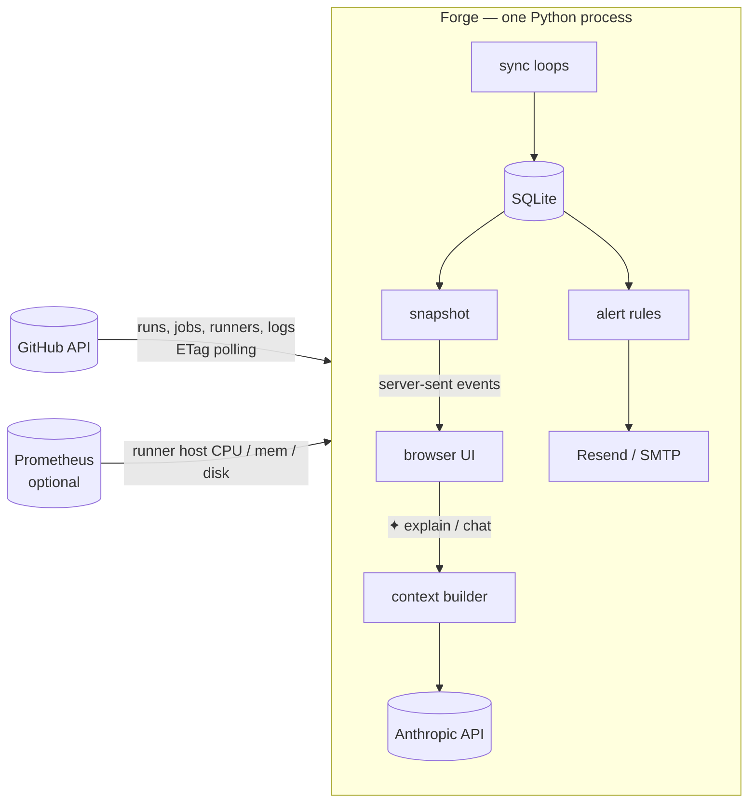

<div align="center">

# ⚡ Forge

**A live dashboard, test tracker and failure alerter for GitHub Actions, with an AI that explains any job in plain English.**

One container · no build step · works with GitHub-hosted and self-hosted runners

[Quick start](#quick-start) · [Features](#features) · [Install options](#install-options) · [Configuration](docs/configuration.md) · [How it works](docs/how-it-works.md)

</div>


GitHub's Actions tab shows you one repository at a time and says nothing when something breaks at 2 a.m. Forge watches all your repos at once, shows what's running right now, tracks every test suite over time, emails you when a workflow goes red (and when it's green again), and lets anyone on the team press ✦ to get a plain-English answer to *"what is this job and why did it fail?"*

I built it to run CI for my own projects on a self-hosted runner in my homelab. That's why it also tracks runner health and **how much each self-hosted minute saves** compared with GitHub-hosted pricing.

## Quick start

You need Docker. Then run:

```bash
curl -fsSL https://raw.githubusercontent.com/codephilip/forge-ci/main/install.sh | bash
```

The installer:

- reuses your GitHub CLI login if you have one (or asks for a token)
- suggests your most recently active repos
- checks it can read each of them
- optionally asks for AI and email settings
- starts Forge at **http://localhost:8080**

Settings go to `~/.forge-ci/forge.env`, readable only by you. Re-running it is safe. Prefer to read a script before you run it? [It's here](install.sh), about 200 lines.

<details>
<summary>Non-interactive (CI, provisioning scripts)</summary>

```bash
GITHUB_TOKEN=ghp_… FORGE_REPOS=owner/repo,owner/other \
  bash -c "$(curl -fsSL https://raw.githubusercontent.com/codephilip/forge-ci/main/install.sh)" -- --yes
```

Flags: `--yes` (no prompts), `--reconfigure`, `--uninstall` (keeps data), `--purge` (removes data and config).
Environment: `FORGE_PORT` (default 8080), `FORGE_IMAGE`, `FORGE_CONF_DIR`.
</details>

## Features

**Live overview**
- Jobs in flight, with step-by-step progress bars and ticking timers; queued jobs show what they're waiting for.
- Every run across every watched repo, filterable by status, repo and where it ran. Click a run for a **timeline of its jobs**, with the failing step called out.

  
- **Runner fleet:** each self-hosted runner's state (idle, busy or offline), what it's running, and how busy it was over 24 h. Add Prometheus and you also get the runner machine's CPU, memory and disk.
- 7-day pass rate, median and p90 run time, how long jobs wait for a runner, failures in the last 24 h, and **minutes saved on self-hosted runners** priced at GitHub's per-minute rate.

**Testing view**
- Every test and check suite in one list, **failing and flaky first**. Each row shows the last 20 results, pass rate, median duration and where it runs.
- Real counts read from the job logs: **vitest, jest, go test, eslint and tsc** (for example *16,248 passed · 2 skipped*, or *0 errors · 103 warnings*).
- **Names of the tests that failed**, taken straight from the log, so you don't have to download 6,000 lines to find them.

  

**AI explainer and chat** *(optional; needs an Anthropic API key)*
- A ✦ button on every job, run, test suite and runner. Press it for a short, plain-language explanation: what it is, why it runs, what the latest result means, and what to do next.
- Forge gives the model the job's steps, parsed results, **an excerpt of the log around the first error** and the workflow file, so answers are about *your* failure, not CI in general.
- Follow-up chat keeps that context, with suggested questions and an **Ask Forge** button for questions about the whole dashboard.
- First explanations are cached for each item and result, so everyone after the first person gets them instantly and free. A per-person rate limit caps spending.

**Alerts**
- Email when a workflow goes from passing to **failing**, when it **recovers**, and when a self-hosted runner has been **offline** for 5 minutes. It only emails when something changes, so a job that keeps failing doesn't flood your inbox.
- Works with [Resend](https://resend.com) or any SMTP server. There's a "Send test email" button.

**Mobile-friendly** too:


## Install options

| | Best for | How |
|---|---|---|
| **One-line installer** | trying it out, a single server | `curl -fsSL …/install.sh \| bash` |
| **Docker Compose** | keeping config in a folder | `cp .env.example .env`, edit it, `docker compose up -d` |
| **Docker** | full control | see below |
| **Kubernetes** | clusters | `kubectl apply -k deploy/kubernetes` ([guide](docs/configuration.md#kubernetes)) |
| **Plain Python** | hacking on it | `GITHUB_TOKEN=… FORGE_REPOS=… python3 forge/server.py`. Needs no dependencies except the optional `anthropic` package. |

```bash
docker run -d --name forge-ci -p 8080:8080 \
  -e GITHUB_TOKEN=ghp_… -e FORGE_REPOS=owner/repo \
  -v forge-ci-data:/data --restart unless-stopped \
  ghcr.io/codephilip/forge-ci:latest
```

### What token do I need?

| You want to… | Token |
|---|---|
| watch public repos | any token (it just raises GitHub's rate limit) |
| watch private repos | classic PAT with **`repo`** |
| see an org's self-hosted runners, or auto-watch every private repo in an org | add **`admin:org`** (Forge only reads) |

[Create a classic token →](https://github.com/settings/tokens/new?scopes=repo&description=Forge) · Every setting is in **[docs/configuration.md](docs/configuration.md)**.

## Security

- **Forge has no login.** Anyone who can reach it can see your runs, and with AI enabled can spend your Anthropic credit. Run it on a private network, or put an authenticating proxy in front (Tailscale, Cloudflare Access, oauth2-proxy).
- Tokens live only in the environment (`~/.forge-ci/forge.env`, mode 600, or a Kubernetes Secret). They are never written to the database or shown in the UI.
- Forge only **reads** from GitHub. The only things it writes are emails and requests to the Anthropic API.
- Logs sent to the AI are treated as data, not instructions. GitHub already masks secrets in Actions logs.

## How it works



- **Polling with ETags instead of webhooks.** Forge works from behind a NAT with no public endpoint. Unchanged responses come back as `304 Not Modified`, which don't count against GitHub's rate limit, so watching a handful of busy repos uses a few hundred requests an hour out of 5,000.
- **SQLite and a single process.** One container, one volume, no database server to run. History is kept for 45 days.
- **Server-sent events.** The browser receives a new snapshot only when something actually changed; timers tick on the client.
- **The server uses only the Python standard library.** The Anthropic SDK is the one optional dependency, which keeps the image small and the code easy to read.

More detail, including why jobs that use secrets shouldn't run on self-hosted runners, is in **[docs/how-it-works.md](docs/how-it-works.md)**.

## Development

```bash
git clone https://github.com/codephilip/forge-ci && cd forge-ci
python3 -m unittest discover -s tests -v          # parser + classification tests
GITHUB_TOKEN=$(gh auth token) FORGE_REPOS=vuejs/core FORGE_DB=/tmp/forge.db python3 forge/server.py
```

The UI is a single file, `forge/index.html`, with no build step: edit it and refresh. CI runs the tests and publishes a multi-arch image (amd64 and arm64) to GHCR on every push to `main`.

## Limitations

- GitHub Actions only.
- Test counts come from log summaries. Runners Forge doesn't recognise (pytest, rspec and so on) still show pass/fail, just without counts.
- One instance per database (SQLite); it isn't built for high availability.
- The "saved" figure uses GitHub's Linux 2-core price ($0.006 per minute, set with `FORGE_MINUTE_PRICE`). Larger runners cost more, so the real saving can be higher.

## License

[MIT](LICENSE)
