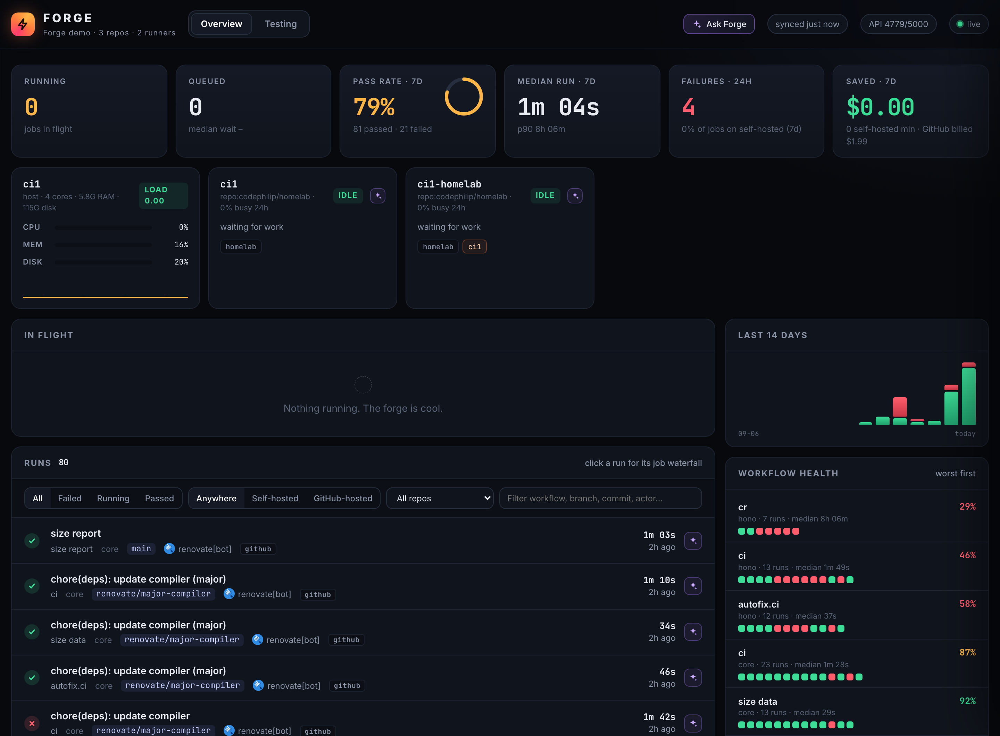
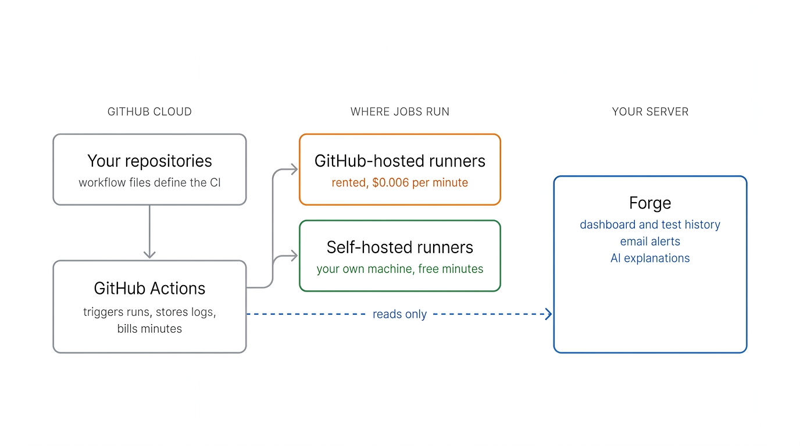
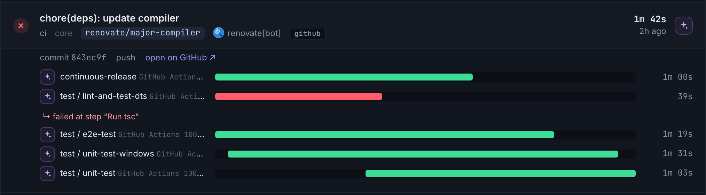
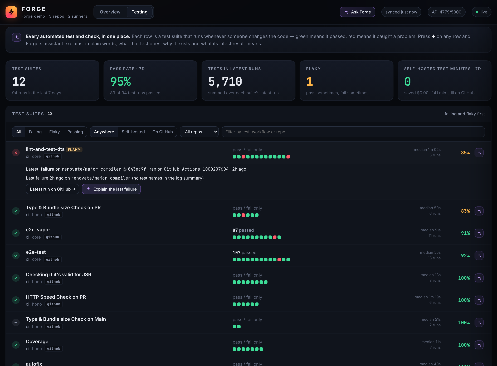
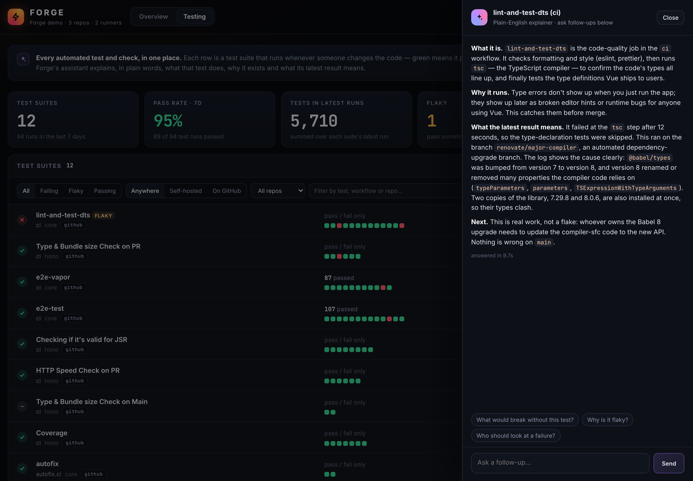
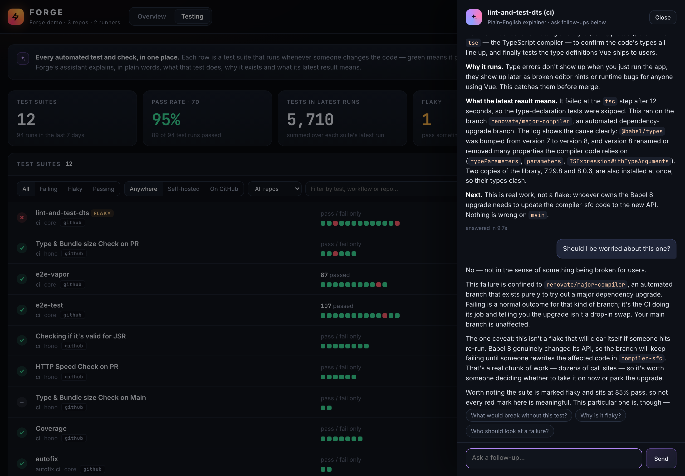
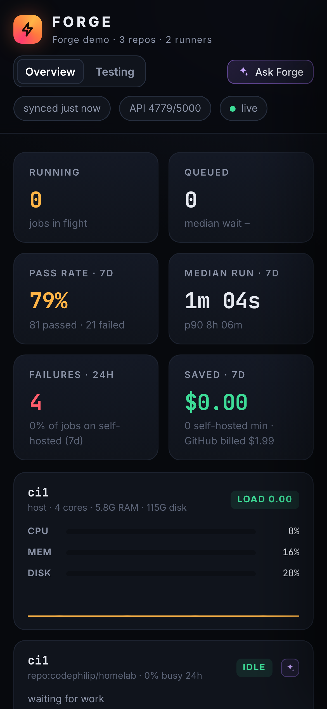
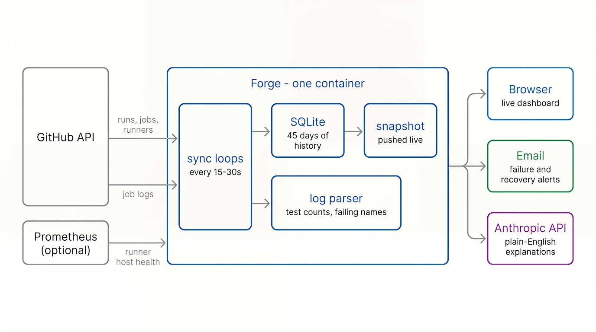

<div align="center">

# ⚡ Forge

**A live dashboard, test tracker and failure alerter for GitHub Actions, with an AI that explains any job in plain English.**

One container · no build step · works with GitHub-hosted and self-hosted runners

[](https://github.com/codephilip/forge-ci/releases)
[](https://github.com/codephilip/forge-ci/actions/workflows/ci.yml)
[](LICENSE)

[What it is](#what-it-is) · [Quick start](#quick-start) · [Credentials](#credentials-what-youll-be-asked-for-and-why) · [Features](#features) · [Self-hosted runners](docs/self-hosted-runners.md) · [Configuration](docs/configuration.md)

</div>



## What it is

Forge reads the GitHub Actions API for the repositories you list and shows what it finds: runs in progress, every test suite's history, which runner each job used, and what your self-hosted minutes would have cost on GitHub's. It emails when a workflow breaks or recovers, and can explain any job in plain English using the Anthropic API.

It does not run CI. GitHub still triggers the runs and stores the logs; the jobs still execute on a runner — either one GitHub rents you, or one of your own.



Forge was written to sit on top of **self-hosted runners**, which is why it tracks runner state, runner-host CPU, memory and disk, and the cost difference per minute. It works the same way if every job runs on GitHub-hosted runners — the savings figures are simply zero. Setting up your own runners, and moving a job onto them, is covered in **[docs/self-hosted-runners.md](docs/self-hosted-runners.md)**.

## Quick start

You need Docker. Then run:

```bash
curl -fsSL https://raw.githubusercontent.com/codephilip/forge-ci/main/install.sh | bash
```

The installer:

- reuses your GitHub CLI login if you have one (or asks for a token)
- suggests your most recently active repos
- checks it can read each of them
- optionally asks for AI and email settings
- starts Forge at **http://localhost:8080**

Settings go to `~/.forge-ci/forge.env`, readable only by you. Re-running it is safe. Prefer to read a script before you run it? [It's here](install.sh), about 200 lines.

<details>
<summary>Non-interactive (CI, provisioning scripts)</summary>

```bash
GITHUB_TOKEN=ghp_… FORGE_REPOS=owner/repo,owner/other \
  bash -c "$(curl -fsSL https://raw.githubusercontent.com/codephilip/forge-ci/main/install.sh)" -- --yes
```

Flags: `--yes` (no prompts), `--reconfigure`, `--uninstall` (keeps data), `--purge` (removes data and config).
Environment: `FORGE_PORT` (default 8080), `FORGE_IMAGE`, `FORGE_CONF_DIR`.
</details>

## Credentials: what you'll be asked for, and why

Forge needs **one** credential to work: a GitHub token. Everything else is optional and switches on an extra feature. The installer asks for each in turn (press Enter to skip the optional ones) and saves them in `~/.forge-ci/forge.env`, readable only by your user. With Docker Compose they go in `.env`; on Kubernetes, in a Secret. They're only ever sent to the service they belong to.

### 1. GitHub token (required)

**Why:** Forge reads your workflow runs, jobs, logs and self-hosted runners through the GitHub API. Without a token it can't see private repos, can't read job logs (so no test counts), and runs into GitHub's anonymous rate limit of 60 requests an hour.

**If you use the GitHub CLI (`gh`),** the installer picks up your existing login automatically and you won't be asked for a token.

**Otherwise, create a classic token:**
1. Open **[github.com/settings/tokens/new](https://github.com/settings/tokens/new?scopes=repo&description=Forge)** (this link pre-fills the `repo` scope and a name).
2. Choose scopes:

   | You want to… | Scopes to tick |
   |---|---|
   | watch public repos only | none (the token just identifies you and raises the rate limit to 5,000/hour) |
   | watch private repos | **`repo`** |
   | see an org's self-hosted runners, or auto-watch every private repo in an org | **`repo`** + **`admin:org`** |

3. Set an expiry you'll remember. Forge stops updating when the token expires.
4. Paste it when the installer asks. The installer checks it straight away and tells you which account it belongs to.

Forge only ever **reads** from GitHub. `admin:org` is needed because GitHub doesn't offer a read-only scope for listing org runners, but Forge never uses it to change anything.

> Fine-grained tokens also work, but only if everything you watch belongs to one owner. See [configuration.md](docs/configuration.md#token-scopes).

### 2. Repos to watch (required)

Not a secret, just a list: `owner/repo,owner/other-repo`. The installer suggests your three most recently pushed repos and checks it can read each one. To follow a whole organisation instead, give its name when asked ("Also watch every private repo in an org?").

### 3. Anthropic API key (optional: turns on the ✦ AI explainer and chat)

**Why:** the ✦ buttons send the selected job's details (steps, results, a log excerpt, the workflow file) to Anthropic's API and stream back a plain-English explanation. Without a key, everything else works and the ✦ buttons say "AI is not configured".

**How:** create a key at **[console.anthropic.com → API keys](https://console.anthropic.com/settings/keys)**. The account needs API **credit** (Plans & Billing); a key on an account with no balance is accepted, but every answer comes back with a "credit balance is too low" error.

**Cost control:** explanations are cached, so a job's first explanation is the only one that costs anything; everyone after that gets the saved answer. Questions are limited to 40 per person per 10 minutes (`FORGE_AI_RATE_PER_10MIN`).

### 4. Email alerts (optional: failure, recovery and runner-offline emails)

**Why:** so you hear about a broken build without keeping the dashboard open.

**How:** give the address alerts should go to, then either:
- a **[Resend](https://resend.com) API key** (free tier is plenty). Until you verify a domain in Resend, mail comes from `onboarding@resend.dev` and Resend only delivers it to your own account's address; after verifying, set `NOTIFY_FROM=Forge CI <ci@your-domain>`; **or**
- your own mail server: add `SMTP_HOST`, `SMTP_PORT`, `SMTP_USER` and `SMTP_PASS` to the settings file.

Use the **Send test email** button in Forge (Alerts panel) to check it.

### 5. Prometheus (optional: runner host CPU / memory / disk)

Only useful if you run your own runner machine with [node-exporter](https://github.com/prometheus/node_exporter). Set `PROM_URL` and `PROM_INSTANCE` in the settings file; there's no secret involved. Details in [configuration.md](docs/configuration.md#runner-host-health-prometheus).

### Changing settings later

Edit `~/.forge-ci/forge.env` and re-run the installer (or `docker restart forge-ci`), or run the installer with `--reconfigure` to be asked everything again. The full list of settings is in **[docs/configuration.md](docs/configuration.md)**.

## Features

**Live overview**
- Jobs in flight, with step-by-step progress bars and ticking timers; queued jobs show what they're waiting for.
- Every run across every watched repo, filterable by status, repo and where it ran. Click a run for a **timeline of its jobs**, with the failing step called out.

  
- **Runner fleet:** each self-hosted runner's state (idle, busy or offline), what it's running, and how busy it was over 24 h. Add Prometheus and you also get the runner machine's CPU, memory and disk.
- 7-day pass rate, median and p90 run time, how long jobs wait for a runner, failures in the last 24 h, and **minutes saved on self-hosted runners** priced at GitHub's per-minute rate.

**Testing view**
- Every test and check suite in one list, **failing and flaky first**. Each row shows the last 20 results, pass rate, median duration and where it runs.
- Real counts read from the job logs: **vitest, jest, go test, eslint and tsc** (for example *16,248 passed · 2 skipped*, or *0 errors · 103 warnings*).
- **Names of the tests that failed**, taken straight from the log, so you don't have to download 6,000 lines to find them.

  

**AI explainer and chat** *(optional; needs an Anthropic API key)*
- A ✦ button on every job, run, test suite and runner. Press it for a short, plain-language explanation: what it is, why it runs, what the latest result means, and what to do next.
- Forge gives the model the job's steps, parsed results, **an excerpt of the log around the first error** and the workflow file, so answers are about *your* failure, not CI in general.
- Follow-up chat keeps that context, with suggested questions and an **Ask Forge** button for questions about the whole dashboard.
- First explanations are cached for each item and result, so everyone after the first person gets them instantly and free. A per-person rate limit caps spending.

  

  *A real failure in `vuejs/core`, explained by pressing ✦ — Forge read the log and found the cause (a major `@babel/types` upgrade renaming properties the compiler uses). Follow-up questions keep the same context:*

  

**Alerts**
- Email when a workflow goes from passing to **failing**, when it **recovers**, and when a self-hosted runner has been **offline** for 5 minutes. It only emails when something changes, so a job that keeps failing doesn't flood your inbox.
- Works with [Resend](https://resend.com) or any SMTP server. There's a "Send test email" button.

**Mobile-friendly** too:



## Install options

| | Best for | How |
|---|---|---|
| **One-line installer** | trying it out, a single server | `curl -fsSL …/install.sh \| bash` |
| **Docker Compose** | keeping config in a folder | `cp .env.example .env`, edit it, `docker compose up -d` |
| **Docker** | full control | see below |
| **Kubernetes** | clusters | `kubectl apply -k deploy/kubernetes` ([guide](docs/configuration.md#kubernetes)) |
| **Plain Python** | hacking on it | `GITHUB_TOKEN=… FORGE_REPOS=… python3 forge/server.py`. Needs no dependencies except the optional `anthropic` package. |

```bash
docker run -d --name forge-ci -p 8080:8080 \
  -e GITHUB_TOKEN=ghp_… -e FORGE_REPOS=owner/repo \
  -v forge-ci-data:/data --restart unless-stopped \
  ghcr.io/codephilip/forge-ci:0.1.0
```

Image tags: `0.1.0` (fixed), `0.1` (patch updates), `latest` (tip of `main`).
Changes are listed in [CHANGELOG.md](CHANGELOG.md); how releases are cut is in
[docs/releasing.md](docs/releasing.md).

Which credentials to use, and why: see **[Credentials](#credentials-what-youll-be-asked-for-and-why)**. Every setting: **[docs/configuration.md](docs/configuration.md)**.

## Security

- **Forge has no login.** Anyone who can reach it can see your runs, and with AI enabled can spend your Anthropic credit. Run it on a private network, or put an authenticating proxy in front (Tailscale, Cloudflare Access, oauth2-proxy).
- Tokens live only in the environment (`~/.forge-ci/forge.env`, mode 600, or a Kubernetes Secret). They are never written to the database or shown in the UI.
- Forge only **reads** from GitHub. The only things it writes are emails and requests to the Anthropic API.
- Logs sent to the AI are treated as data, not instructions. GitHub already masks secrets in Actions logs.

## How it works



- **Polling with ETags instead of webhooks.** Forge works from behind a NAT with no public endpoint. Unchanged responses come back as `304 Not Modified`, which don't count against GitHub's rate limit, so watching a handful of busy repos uses a few hundred requests an hour out of 5,000.
- **SQLite and a single process.** One container, one volume, no database server to run. History is kept for 45 days.
- **Server-sent events.** The browser receives a new snapshot only when something actually changed; timers tick on the client.
- **The server uses only the Python standard library.** The Anthropic SDK is the one optional dependency, which keeps the image small and the code easy to read.

More detail is in **[docs/how-it-works.md](docs/how-it-works.md)**; the runner side is in **[docs/self-hosted-runners.md](docs/self-hosted-runners.md)**, including why jobs that use secrets should stay on GitHub-hosted runners.

*Both diagrams were generated with Nano Banana Pro (Gemini 3 Pro Image).*

## Development

```bash
git clone https://github.com/codephilip/forge-ci && cd forge-ci
python3 -m unittest discover -s tests -v          # parser + classification tests
GITHUB_TOKEN=$(gh auth token) FORGE_REPOS=vuejs/core FORGE_DB=/tmp/forge.db python3 forge/server.py
```

The UI is a single file, `forge/index.html`, with no build step: edit it and refresh. CI runs the tests and publishes a multi-arch image (amd64 and arm64) to GHCR on every push to `main`.

## Limitations

- GitHub Actions only.
- Test counts come from log summaries. Runners Forge doesn't recognise (pytest, rspec and so on) still show pass/fail, just without counts.
- One instance per database (SQLite); it isn't built for high availability.
- The "saved" figure uses GitHub's Linux 2-core price ($0.006 per minute, set with `FORGE_MINUTE_PRICE`). Larger runners cost more, so the real saving can be higher.

## License

[MIT](LICENSE)
